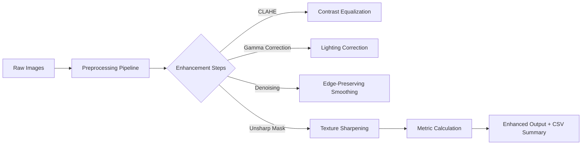

# VisionPrep Web – Intelligent Image Preprocessing for Photogrammetry

**VisionPrep** is a smart, interactive image preprocessing tool built for **photogrammetry optimization**.  
It helps improve **lighting, contrast, and sharpness** while reducing noise and blur —  
enhancing the efficiency and accuracy of **3D reconstruction pipelines** (e.g., Meshroom, COLMAP, Apple Photogrammetry API).

---

## Overview

Photogrammetry pipelines rely on high-quality input images to generate dense and accurate 3D reconstructions.  
However, real-world images often suffer from poor exposure, uneven lighting, noise, and motion blur — leading to longer processing times and less-detailed models.

**VisionPrep Web** solves this by preprocessing your image dataset through a configurable, CPU-friendly enhancement pipeline.  
It provides both **single-image mode** (interactive visualization) and **folder/batch mode** (mass enhancement + ZIP export).

---

## Folder Structure

```
VisionPrep-Web/
├── src/
│   └── preprocess.py          # Core image enhancement functions
├── assets/                    # Optional logos / samples
│   └── logo.png
├── app.py                     # Streamlit WebApp interface
├── requirements.txt
└── README.md
```

---

##  Features

| Feature | Description |
|----------|--------------|
|  **CLAHE (Adaptive Histogram Equalization)** | Improves local contrast and texture detail |
|  **Gamma Correction** | Adjusts brightness and lighting balance |
|  **Bilateral Denoising** | Reduces noise while preserving edges |
|  **Unsharp Masking** | Sharpens fine texture and structure |
|  **Sharpness & Brightness Metrics** | Evaluates quality improvement quantitatively |
|  **Batch Processing Mode** | Enhances entire folders and exports ZIPs |
|  **CSV Summary Table** | Logs per-image sharpness and brightness metrics |
|  **CPU Optimized** | Runs efficiently without requiring a GPU |

---

##  Two Operating Modes

###  Single Image Mode
- Upload one photo  
- See **Before / After** comparison instantly  
- Adjust enhancement parameters with sliders  
- Download the processed image

###  Folder / Batch Mode
- Upload multiple photos at once  
- Automatically preprocesses all with your selected parameters  
- Displays **processing time + improvement metrics**
- Download all enhanced images as a `.zip` archive  

---

## Processing Pipeline



---

##  Example Metrics

| File         | Sharpness ↑ | Brightness ↑ | Processing Time |
| ------------ | ----------- | ------------ | --------------- |
| image_01.jpg | +127%       | +18%         | 0.43s           |
| image_02.jpg | +114%       | +15%         | 0.37s           |
| ...          | ...         | ...          | ...             |

---

##  Installation & Usage

### 1 Clone the Repository

```bash
git clone https://github.com/<yourusername>/VisionPrep-Web.git
cd VisionPrep-Web
```

### 2 Install Dependencies

```bash
pip install -r requirements.txt
```

### 3 Launch the WebApp

```bash
streamlit run app.py
```

Then open in your browser:
👉 `http://localhost:8501`

---

## Sample Results

| Metric                         | Before | After | Improvement |
| :----------------------------- | :----: | :---: | :---------: |
| Average Brightness             |  112.4 | 133.1 |    +18.5%   |
| Laplacian Variance (Sharpness) |  98.2  | 219.4 |    +123%    |
| Processing Time (20 Images)    |    —   |  7.8s |      —      |

---

## Technical Highlights

* Built entirely in **Python (OpenCV + Streamlit + NumPy)**
* Runs 100% on **CPU** — no GPU dependency
* Scalable to integrate with **COLMAP / Meshroom**
* Modular codebase: each step can be reused for research analysis
* Great for **comparative photogrammetry experiments**

---

## Why VisionPrep?

| Problem                      | VisionPrep Solution                             |
| ---------------------------- | ----------------------------------------------- |
| Noisy or unevenly lit images | Adaptive histogram equalization                 |
| Over/underexposed shots      | Gamma correction tuning                         |
| Motion blur                  | Laplacian variance analysis + sharpening        |
| Long photogrammetry runtime  | Preprocessed inputs → faster feature extraction |
| Poor texture reconstruction  | Enhanced edges and contrast                     |

---

## Evaluation Metrics

| Metric                 | Description          |
| ---------------------- | -------------------- |
| **Laplacian Variance** | Sharpness indicator  |
| **Mean Brightness**    | Exposure uniformity  |
| **Entropy** *(future)* | Texture richness     |
| **Processing Time**    | Efficiency benchmark |

---

##  Future Enhancements

* Recursive folder input (entire dataset directories)
* Quality dashboard with histograms and graphs
* Adaptive AI-based parameter tuning
* Integration with photogrammetry benchmarks (COLMAP / Meshroom)
* Deployable REST API (via FastAPI)
* Streamlit Cloud and HuggingFace Spaces support

---

## Requirements

| Library   | Version |
| --------- | ------- |
| Python    | 3.8+    |
| Streamlit | ≥1.35   |
| OpenCV    | ≥4.9    |
| Pillow    | ≥10     |
| Pandas    | ≥2.0    |
| NumPy     | ≥1.26   |

Install all with:

```bash
pip install -r requirements.txt
```

---

## Ideal Use Cases

* Orthopedic imaging (CT/X-ray preprocessing before reconstruction)
* Drone-based photogrammetry mapping
* Archaeological artifact scanning
* Indoor scene reconstruction (low-light)
* Industrial inspection / defect analysis

---

##  License

MIT License © 2025 [Your Name]

---

## Citation

> [Selvam-DG], *"VisionPrep – Intelligent Image Preprocessing for Photogrammetry"*, 2025.
> GitHub Repository: [github.com/Selvam-DG/VisionPrep-Web](https://github.com/Selvam-DG/VisionPrep-Web)

---

## ⭐ Contribute & Support

If you like this project or use it in your research:

* ⭐ **Star this repo**
*  Share ideas via Issues / Discussions

Your support encourages more open research tools!

---

### Summary

> VisionPrep bridges the gap between *raw photogrammetry inputs* and *optimized 3D reconstruction performance* — empowering researchers and engineers to preprocess smarter, reconstruct faster, and visualize better.